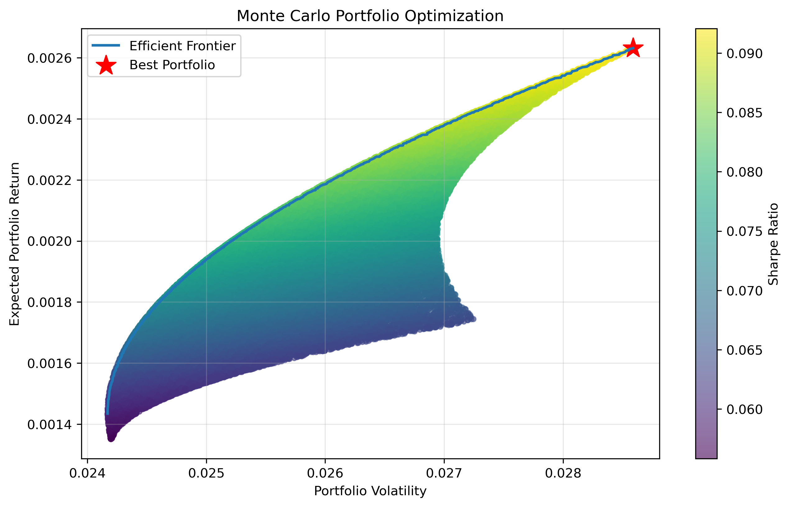

# Historical VaR & Monte Carlo Portfolio Optimization


A Python-based quantitative finance project for measuring portfolio risk and exploring portfolio optimization using historical market data and Monte Carlo simulation.

The project calculates **Historical Value at Risk (VaR)**, **Expected Shortfall (ES)**, portfolio volatility, expected returns, and searches thousands of randomly generated portfolios for attractive risk-adjusted returns.

## Project Overview

This project combines two common quantitative finance tasks:

1. **Risk measurement** — How much could a portfolio lose on a typical bad day?
2. **Portfolio optimization** — How should capital be allocated across assets to improve risk-adjusted performance?

The project currently uses historical data for:

* Apple (AAPL)
* Microsoft (MSFT)
* Alphabet (GOOGL)

Historical price data is used to calculate daily returns and construct the portfolio risk and return measures.

---

## Key Concepts

### Historical Value at Risk

Historical VaR estimates a portfolio's potential loss by looking at the distribution of its historical returns.

For example, a 95% VaR asks:

> "Based on historical returns, what daily loss would only be exceeded about 5% of the time?"

The project calculates VaR directly from the historical return distribution without assuming that returns follow a normal distribution.

### Expected Shortfall

Expected Shortfall (ES) goes one step further than VaR.

Instead of asking where the loss threshold is, ES asks:

> "When losses are worse than the VaR threshold, how large are those losses on average?"

This makes ES useful for understanding the severity of losses in the portfolio's worst historical outcomes.

### Portfolio Volatility

Portfolio volatility measures the overall variability of portfolio returns.

Unlike simply averaging individual stock volatilities, portfolio volatility accounts for the relationships between assets through the covariance matrix.

### Monte Carlo Portfolio Optimization

The optimizer generates thousands of random portfolios.

For each portfolio it calculates:

* Expected return
* Portfolio volatility
* Sharpe ratio
* Asset weights

The portfolio with the highest Sharpe ratio is selected as the best simulated portfolio.

The optimizer also supports minimum and maximum allocation constraints, preventing the simulation from placing an unrealistic amount of capital into a single asset.

### Efficient Frontier

The project also identifies an approximate efficient frontier from the simulated portfolios.

The frontier represents portfolios offering the highest observed return for a given level of volatility.

Because the frontier is generated from randomly simulated portfolios, it is an approximation rather than an exact analytical solution.

---

## Example Optimization Result

One simulated result produced a portfolio similar to:

```text
Best Portfolio
Return:      0.002301
Volatility:  0.027118
Sharpe:      0.084849

Weights:
AAPL: 59.98%
MSFT: 30.47%
GOOGL: 9.54%
```

The exact result changes between runs because the Monte Carlo optimizer generates random portfolios.

---

## Monte Carlo Optimization

The optimizer can enforce portfolio allocation constraints.

For example:

```python
results, best_portfolio, best_weights = monte_carlo_portfolios(
    10000,
    0.50,
    0.10
)
```

This searches 10,000 portfolios while requiring each asset to have:

```text
Minimum weight: 10%
Maximum weight: 50%
```

The portfolio weights always sum to 100%.

---

## Visualization

The Monte Carlo simulation produces a scatter plot showing the simulated portfolios.

* **X-axis:** Portfolio volatility
* **Y-axis:** Expected portfolio return
* **Point shading:** Sharpe ratio
* **Star:** Best-Sharpe portfolio
* **Line:** Approximate efficient frontier

The generated visualization is saved to:

```text
results/monte_carlo.png
```


---

## Project Structure

```text
historical-var-engine/
│
├── data/
│   └── raw/
│       ├── AAPL.csv
│       ├── MSFT.csv
│       └── GOOGL.csv
│
├── results/
│   └── monte_carlo.png
│
├── src/
│   ├── returns.py
│   ├── var.py
│   ├── covariance.py
│   ├── optimization.py
│   ├── portfolio.py
│   ├── monte_carlo.py
│   └── plotting.py
│
├── .gitignore
└── README.md
```

---

## Technologies

* Python
* NumPy
* pandas
* Matplotlib

---

## Methodology

The general workflow is:

```text
Historical Price Data
        ↓
Daily Returns
        ↓
Portfolio Returns
        ↓
Covariance Matrix
        ↓
Expected Return + Volatility
        ↓
Monte Carlo Simulation
        ↓
10,000 Random Portfolios
        ↓
Sharpe Ratio
        ↓
Best Simulated Portfolio
        ↓
Efficient Frontier Visualization
```

---

## Limitations

This project is intended as an educational quantitative finance project rather than a production trading or risk-management system.

Important limitations include:

* Historical returns may not represent future market behavior.
* The Monte Carlo optimizer uses randomly generated portfolios rather than solving the optimization problem analytically.
* Expected returns are estimated using historical average returns.
* The portfolio currently contains only three assets.
* No transaction costs or taxes are included.
* No short selling is currently modeled.
* The efficient frontier is an approximation based on simulated portfolios.

---

## Future Improvements

Potential extensions include:

* Implementing exact Markowitz optimization with `scipy.optimize`
* Adding more assets
* Supporting short positions
* Adding a risk-free rate to the Sharpe ratio
* Annualizing returns and volatility
* Adding rolling VaR and Expected Shortfall analysis
* Adding portfolio performance charts
* Comparing optimized portfolios against equal-weight portfolios
* Adding additional optimization objectives such as minimum volatility
* Adding automated tests with `pytest`

---

## Disclaimer

This project is for educational and research purposes only and does not constitute financial advice.
